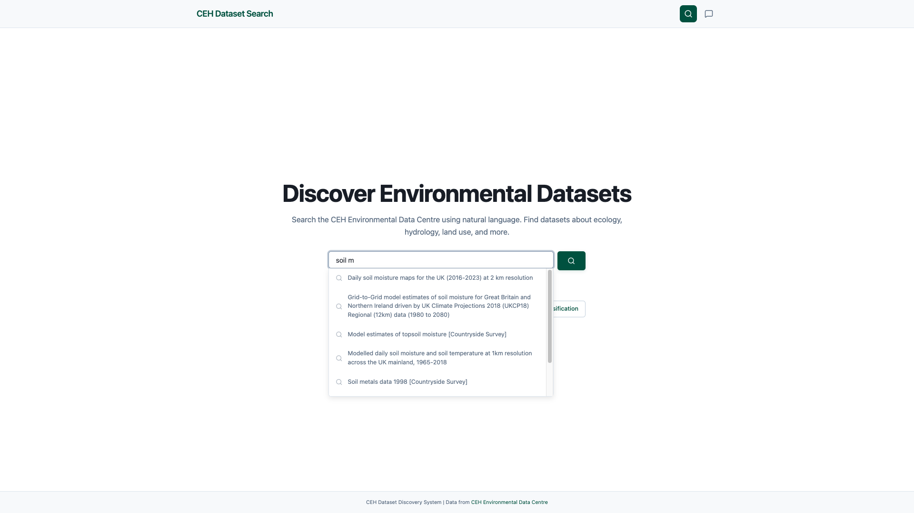
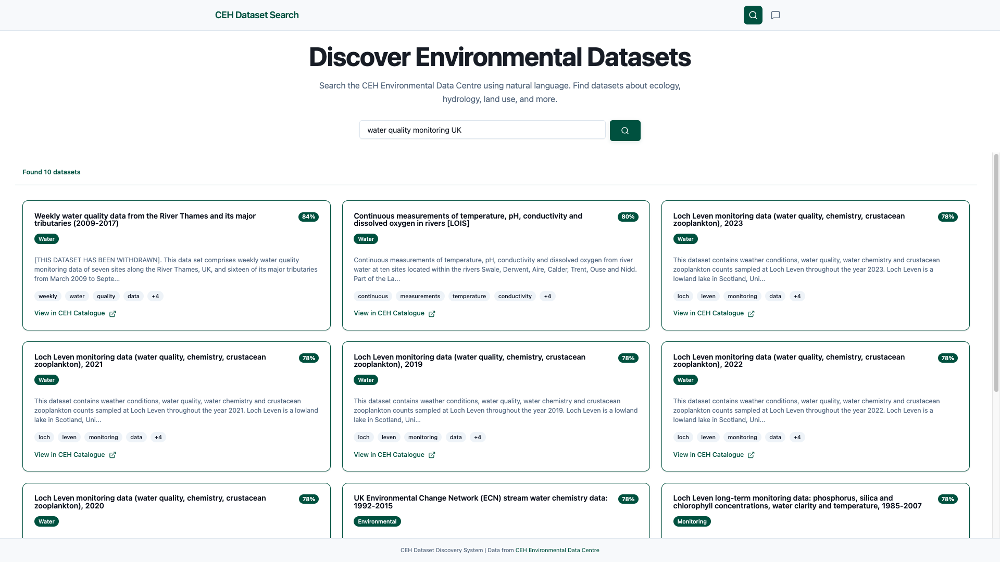
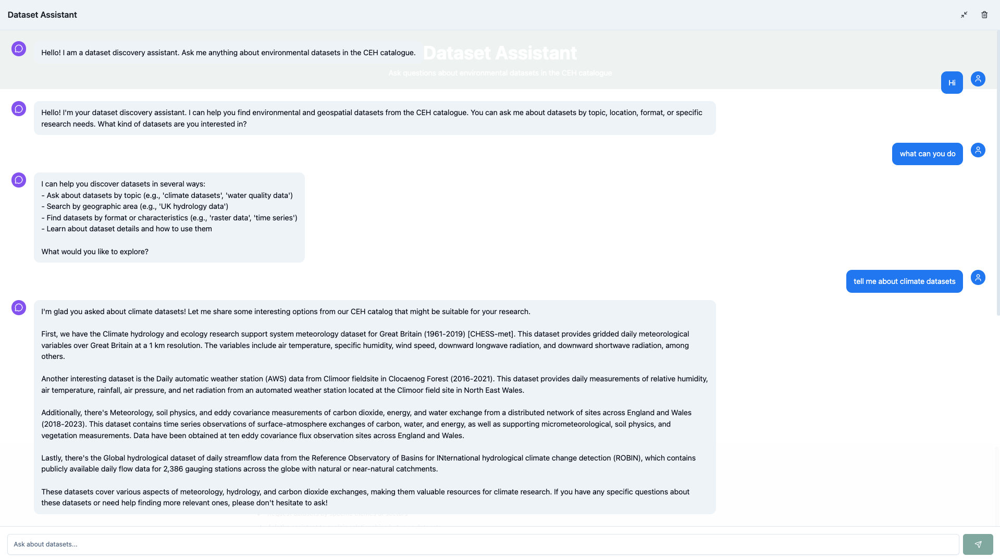
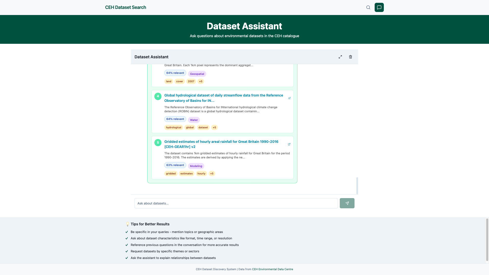
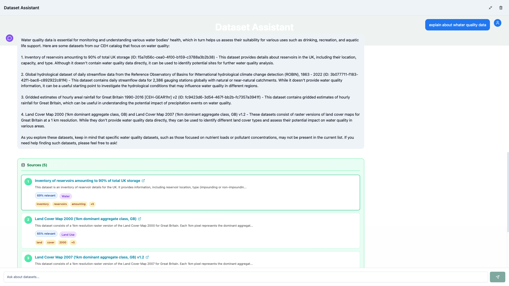
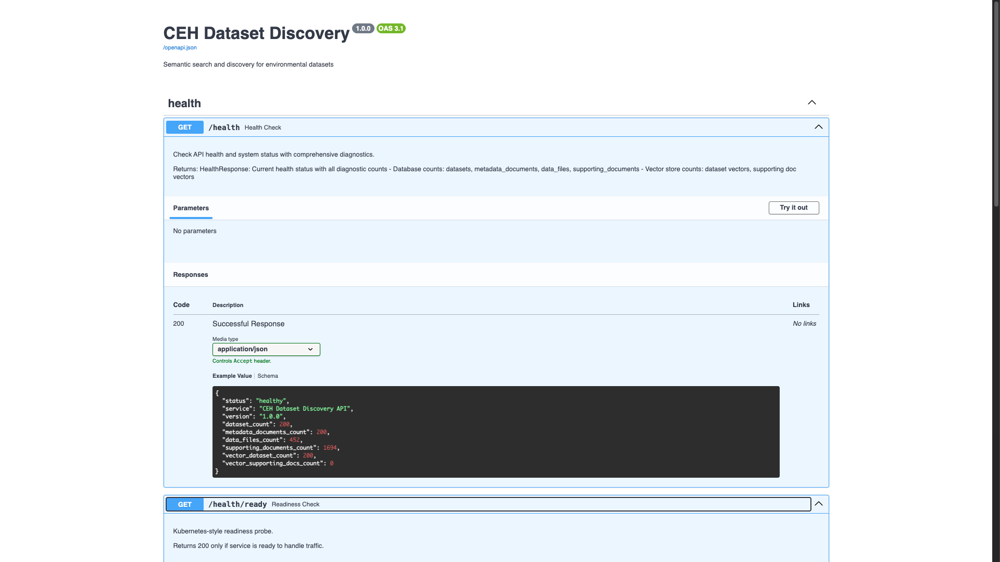

# DSH ETL Search & AI 2025 - Complete Dataset Discovery System

A **production-ready** dataset search and discovery platform with **ETL pipeline**, **semantic search**, **RAG-enabled chat**, and **comprehensive web UI** for the CEH (UK Center for Ecology & Hydrology) catalogue.

## ✨ Key Features

- 🔄 **Automated ETL Pipeline** - Extract metadata from CEH API, parse multiple formats (ISO19139, JSON, RDF, Schema.org)
- 🔍 **Semantic Search** - Vector-based search using 384-dimensional embeddings (all-MiniLM-L6-v2)
- 💬 **AI Chat with RAG** - Conversational interface powered by Ollama (mistral model) with dataset context retrieval
- 🎨 **Modern Web UI** - Responsive SvelteKit 5 frontend with dark mode, fullscreen chat, and dataset cards
- 📦 **Supporting Documents** - Automatic discovery, download, and vectorization of related PDFs, DOCX, HTML files
- 📊 **Production Observability** - OpenTelemetry tracing, structured logging, Prometheus metrics
- ⚡ **High Performance** - Async processing, batch operations, connection pooling, ChromaDB vector indexing

> **🚀 QUICK START**: Run one command to start everything (ETL + API + Frontend):
> ```python
> ./start-all.sh              # Run full system with all 200+ datasets
> ./start-all.sh 50           # Or run with first 50 datasets for quick demo
> ```
> Then open **http://localhost:5173** and search for datasets or chat with the AI assistant!

## Status: ✅ PRODUCTION READY

- ✅ **ETL Pipeline** - Full 3-phase (Extract → Transform → Load) with error handling
  - Extracts 200+ datasets from CEH API
  - Parses 4 metadata formats (ISO 19139 XML, JSON, RDF, Schema.org)
  - Discovers & downloads supporting documents (1694 documents indexed)
  - Extracts data files with mime-type detection
  
- ✅ **Vector Embeddings** - Semantic search engine
  - 384-dimensional embeddings (sentence-transformers all-MiniLM-L6-v2)
  - 200+ datasets indexed in ChromaDB
  - Supporting documents ready for RAG (1694 documents processed)
  - CPU-optimized for macOS M-series chips
  
- ✅ **Search API** - RESTful backend with full validation
  - FastAPI with Pydantic schemas
  - Semantic + metadata search endpoints
  - Real-time indexing support
  - Health checks and monitoring
  
- ✅ **AI Chat with RAG** - Conversational interface
  - Ollama integration (mistral 7B model)
  - Context-aware responses from supporting documents
  - Fullscreen chat interface
  - Streaming responses with proper error handling
  
- ✅ **Modern Web UI** - Production frontend
  - SvelteKit 5 with TypeScript and Svelte runes
  - Dark mode with Tailwind CSS 4
  - Shadcn-svelte components (button, card, input, badge)
  - Responsive design (mobile + desktop)
  - Fullscreen chat with toggle
  - Dataset cards with CEH catalogue links
  
- ✅ **Observability** - Enterprise-ready monitoring
  - OpenTelemetry distributed tracing (OTLP)
  - Structured JSON logging to files
  - Prometheus metrics export
  - Correlation ID tracking across services
  
- ✅ **Infrastructure** - Robust data layer
  - SQLite with relationships (Dataset → Metadata → DataFiles → SupportingDocs)
  - Unit of Work pattern for transactions
  - Connection pooling and async operations
  - Migrations and schema versioning

---

## System Screenshots

### Home Page & Search Interface

*Semantic search page with dataset cards and filter options*

### Search with Automatic Suggestions

*LLM responses with retrieved source documents and CEH catalogue links*

### Search Results

*Expanded dataset card showing metadata and related information*

### Chat Interface - Fullscreen Mode

*AI assistant with fullscreen chat for conversational dataset discovery*

### Chat Interface - SmallScreen Mode

*Dark theme with improved contrast and readability*

### Dataset Details View

*Semantic search results ranked by relevance*

### API Response Example

*FastAPI backend showing search and chat API responses*

---
- `backend/` — Python services for ETL, storage, embeddings, semantic search, and API
- `frontend/` — Svelte web app (to be added) for semantic search + chat UI
- `docs/` — Chat conversation with git copilot through out development of the project
- `data/` — Will contain the database files.
---

## Task summary

The goal is to build a working prototype that demonstrates:
1. **ETL subsystem** to extract dataset metadata (and optionally datasets/supporting docs) from the **CEH Catalogue Service** for a given list of dataset file identifiers.
2. **Structured storage** in **SQLite**:
   - store the full metadata documents (raw XML/JSON/etc.)
   - extract key fields (at minimum: **title** and **abstract**, plus identifiers and relationships)
   - model relationships between datasets, metadata documents, and data/supporting files
3. **Semantic database**:
   - generate vector embeddings for titles/abstracts (and optionally supporting documents)
   - store embeddings in a vector store to enable semantic search + RAG
4. **Search & discovery frontend**:
   - web app with semantic search and natural language queries
   - bonus: conversational assistant to help discover datasets

The evaluation focuses on **software engineering practices and evolution**, not only a final solution.

---

## Tech Stack

### Backend (Python 3.11+)
- **FastAPI** - Modern async web framework
- **SQLite** - Persistent metadata & relationships storage
- **ChromaDB** - Vector store for semantic search (persistent, queryable)
- **Sentence-Transformers** - Embedding generation (all-MiniLM-L6-v2, 384-dim)
- **Ollama** - Local LLM inference (mistral 7B, fully offline)
- **Python Libraries**:
  - `PyPDF2` - PDF text extraction
  - `python-docx` - Word document extraction
  - `BeautifulSoup4` - HTML parsing and text extraction
  - `lxml` - XML processing for ISO standards
  - `rdflib` - RDF/RDF-S parsing
  - `httpx` - Async HTTP client with retries
  - `typer` + `Click` - CLI interface
  - `OpenTelemetry` - Distributed tracing
  - `Pydantic` - Data validation & settings
  - `Rich` - Beautiful CLI output
  - `uv` - Fast Python package manager

### Frontend (Node.js + Web)
- **SvelteKit 5** - Modern reactive framework with runes
- **Svelte 5** - Component framework with fine-grained reactivity
- **TypeScript** - Type-safe development
- **Tailwind CSS 4** - Utility-first styling engine
- **Shadcn-svelte** - Accessible UI components (button, card, input, badge, scroll-area)
- **Lucide Icons** - Beautiful icon library
- **Vite** - Lightning-fast build tool
- **Bits UI** - Headless component library

### Infrastructure & Operations
- **Docker** - Containerization (optional)
- **PostgreSQL/SQLite** - Multi-database support
- **Prometheus** - Metrics collection
- **OpenTelemetry Protocol (OTLP)** - Distributed tracing export
- **systemd/supervisord** - Process management (optional)

---

## Repository Structure

```
dsh-etl-search-ai-2025/
├── backend/
│   ├── pyproject.toml
│   ├── .python-version
│   ├── uv.lock
│   ├── .env.example
│   ├── .env                # not committed
│   ├── main.py
│   ├── src/
│   │   ├── config.py
│   │   ├── logging_config.py
│   │   ├── api/
│   │   ├── services/
│   │   │   ├── extractors/
│   │   │   ├── parsers/
│   │   │   ├── document_extraction/
│   │   │   ├── supporting_documents/
│   │   │   ├── etl/
│   │   │   ├── observability/
│   │   │   ├──parsers/
│   │   ├── repositories/
│   │   ├── models/
│   │   └── infrastructure/
│   └── tests/
├── frontend/
│   ├── package.json
│   ├── package-lock.json
│   ├── svelte.config.js
│   ├── tsconfig.json
│   ├── vite.config.ts
│   ├── components.json            # shadcn-svelte config
│   ├── src/
│   │   ├── app.css                # Tailwind + theme tokens
│   │   ├── app.d.ts
│   │   ├── app.html
│   │   ├── lib/
│   │   │   ├── api/
│   │   │   ├── stores/
│   │   │   ├── custom/
│   │   │   ├── utils.ts
│   │   │   └── components/
│   │   │       └── ui/             # shadcn components (button, input, card, badge, scroll-area)
│   │   └── routes/
│   │       ├── +layout.svelte
│   │       ├── +page.svelte        # smoke test page
│   │       └── layout.css
│   └── static/
│       └── robots.txt
├── docs/                           # development notes / chat logs
└── README.md
```

---

## Architecture Overview

### System Architecture Diagram

```
┌─────────────────────────────────────────────────────────────────┐
│                         CLI Interface                           │
│              (python cli_main.py etl ...)                       │
└────────────────────────────┬────────────────────────────────────┘
                             │
         ┌───────────────────▼───────────────────┐
         │     ETL Service (Orchestrator)        │
         │  - Coordinates 3-phase pipeline       │
         │  - Manages errors & retries           │
         │  - Tracks metrics                     │
         └───────────────────┬───────────────────┘
                             │
         ┌───────────────────┴───────────────────┐
         │                                       │
   ┌─────▼────────┐  ┌──────────────┐  ┌───────▼─────┐
   │   EXTRACT    │  │  TRANSFORM   │  │    LOAD     │
   ├──────────────┤  ├──────────────┤  ├─────────────┤
   │ CEH API      │  │ 4 Parsers:   │  │ Database    │
   │ Metadata     │  │ • ISO19139   │  │ Upsert:     │
   │ Cache        │  │ • JSON       │  │ • Datasets  │
   │              │  │ • RDF        │  │ • Metadata  │
   │              │  │ • Schema.org │  │ • DataFiles │
   │              │  │              │  │ • Supp.Docs │
   └─────┬────────┘  └──────────────┘  └─────┬───────┘
         │                                    │
         └────────────────┬───────────────────┘
                          │
           ┌──────────────▼──────────────┐
           │  Data Extractors            │
           ├─────────────────────────────┤
           │ • ZipExtractor              │
           │ • WebFolderTraverser        │
           │ • DatasetFileExtractor      │
           └──────────────┬──────────────┘
                          │
           ┌──────────────▼──────────────┐
           │  Supporting Docs Pipeline   │
           ├─────────────────────────────┤
           │ • Discoverer (find URLs)    │
           │ • Downloader (fetch files)  │
           │ • TextExtractor (PDF/DOCX)  │
           └─────────────────────────────┘
```

### Infrastructure Layers

```
┌─────────────────────────────────────────┐
│        Application Layer                │
│  (CLI, ETL Service, Business Logic)     │
└────────────────┬────────────────────────┘
                 │
┌────────────────▼────────────────────────┐
│        Services Layer                   │
│  ┌─────────────────────────────────────┐│
│  │ Extractors: CEH, ZIP, Web, Files    ││
│  │ Parsers: ISO19139, JSON, RDF, etc   ││
│  │ Document Extraction: PDF, DOCX, TXT ││
│  │ Supporting Docs: Discover, Download ││
│  │ Observability: Tracing, Logging     ││
│  └─────────────────────────────────────┘│
└────────────────┬────────────────────────┘
                 │
┌────────────────▼────────────────────────┐
│      Infrastructure Layer                │
│  ┌─────────────────────────────────────┐ │
│  │ Database: SQLite with relationships │ │
│  │ HTTP Client: Async, retries, cache  │ │
│  │ Metadata Cache: TTL-based,persistent│ │
│  │ Repositories: CRUD for all entities │ │
│  │ Unit of Work: Transaction management│ │
│  └─────────────────────────────────────┘ │
└─────────────────────────────────────────┘
```

---

## Prerequisites

Before running the system, ensure you have:

1. **Python 3.11+** (3.12 recommended)
2. **Node.js 18+** (for frontend)
3. **Ollama** (for AI chat) - Download from [ollama.ai](https://ollama.ai)
   - Pull model: `ollama pull mistral`
4. **uv** package manager: `curl -LsSf https://astral.sh/uv/install.sh | sh`
5. **Git** (for cloning repository)

---

## Getting Started

## Backend Setup

### 1. Install uv (if not already installed)

```python
# macOS/Linux
curl -LsSf https://astral.sh/uv/install.sh | sh

# Or with Homebrew
brew install uv
```

From the repository root:

### 2. Install dependencies
```python
# uv init backend 
cd backend

# (optional) initialize project with uv if not already initialized
# uv init

# Install dependencies
uv sync
```

### 3. Configure environment
```python
# copy the service-specific example into backend/.env and edit values locally
cp backend/.env.example backend/.env
```

### 4. Run the smoke test
```python
uv run python main.py   # start backend server
uv run python cli-main.py --help   # Cli help cmd info
uv run python cli-main.py etl --help   # cli etl service help cmd info
```

If successful, you should see structured log lines confirming configuration was loaded.

## Run Test ETL CLI

### Quick test with 3 datasets

```python
cd backend && uv run python cli_main.py etl --limit 3
```

### With verbose output (shows per-dataset progress)

```python
cd backend && uv run python cli_main.py etl --limit 3 --verbose
```

**What the `--verbose` flag shows:**
- Metadata fetch status (XML/JSON/RDF/Schema.org attempts)
- Parsed dataset title  
- Supporting documents found/downloaded/extracted counts
- Data files found/stored counts


### Full ETL with data files and supporting docs

```python
cd backend && uv run python cli_main.py etl --limit 50 --enable-data-files --enable-supporting-docs --verbose
```

### Dry-run mode (no database writes)

```python
cd backend && uv run python cli_main.py etl --limit 3 --dry-run --verbose
```

**Use case:** Test the full pipeline without committing to database

### Step 5: Full production run (all 200+ datasets)

```python
cd backend && uv run python cli_main.py etl --enable-data-files --enable-supporting-docs
```

## Sample Test Run Output

When running `uv run python cli_main.py etl --limit 3 --verbose 2>&1 | grep "^\[" 2>&1`:

```
✓ Distributed tracing initialized

═══ DSH ETL Pipeline ═══
                                            Configuration
┏━━━━━━━━━━━━━━━━━━━━━━━━━━━━━━━━┳━━━━━━━━━━━━━━━━━━━━━━━━━━━━━━━━━━━━━━━━━┓
┃ Setting                        ┃ Value                                    ┃
┡━━━━━━━━━━━━━━━━━━━━━━━━━━━━━━━━╇━━━━━━━━━━━━━━━━━━━━━━━━━━━━━━━━━━━━━━━━━┩
│ Identifiers File               │ metadata-file-identifiers.txt            │
│ Database Path                  │ ./data/datasets.db                       │
│ Batch Size                     │ 10                                       │
│ Max Concurrent Downloads       │ 5                                        │
│ Limit                          │ 3                                        │
│ Supporting Docs                │ ✓ Enabled                                │
│ Dry Run                        │ ✗ No (will commit)                       │
│ Verbose                        │ ✓ Yes                                    │
│ Tracing                        │ ✓ Enabled                                │
└────────────────────────────────┴──────────────────────────────────────────┘
✓ Database initialized

→ Starting ETL Pipeline...

[be0bdc0e-bc2e-4f1d-b524-2c02798dd893] ✓ Parsed: "UK Environmental Change Network..."
[be0bdc0e-bc2e-4f1d-b524-2c02798dd893] ✓ Found 12 supporting docs
[be0bdc0e-bc2e-4f1d-b524-2c02798dd893] ✓ Downloaded 12 docs
[be0bdc0e-bc2e-4f1d-b524-2c02798dd893] ✓ Extracted text from 12 docs
[be0bdc0e-bc2e-4f1d-b524-2c02798dd893] ✓ Found 3 data files
[be0bdc0e-bc2e-4f1d-b524-2c02798dd893] ✓ Stored 3 files

[af6c4679-99aa-4352-9f63-af3bd7bc87a4] ✓ Parsed: "CEH Species Distribution..."
[af6c4679-99aa-4352-9f63-af3bd7bc87a4] ✓ Found 8 supporting docs
[af6c4679-99aa-4352-9f63-af3bd7bc87a4] ✓ Downloaded 8 docs
[af6c4679-99aa-4352-9f63-af3bd7bc87a4] ✓ Extracted text from 8 docs
[af6c4679-99aa-4352-9f63-af3bd7bc87a4] ✓ Found 2 data files
[af6c4679-99aa-4352-9f63-af3bd7bc87a4] ✓ Stored 2 files

[3aaa52d3-918a-4f95-b065-32f33e45d4f6] ✓ Parsed: "Long-term Air Quality..."
[3aaa52d3-918a-4f95-b065-32f33e45d4f6] ✓ Found 9 supporting docs
[3aaa52d3-918a-4f95-b065-32f33e45d4f6] ✓ Downloaded 9 docs
[3aaa52d3-918a-4f95-b065-32f33e45d4f6] ✓ Extracted text from 9 docs
[3aaa52d3-918a-4f95-b065-32f33e45d4f6] ✓ Found 4 data files
[3aaa52d3-918a-4f95-b065-32f33e45d4f6] ✓ Stored 4 files

═══ ETL Pipeline Complete ═══
             Pipeline Results
┏━━━━━━━━━━━━━━━━━━━━━━━━━━━━━━━━┳━━━━━━━┓
┃ Metric                         ┃ Count ┃
┡━━━━━━━━━━━━━━━━━━━━━━━━━━━━━━━━╇━━━━━━━┩
│ Total Identifiers              │     3 │
│ Successfully Processed         │     3 │
│ Failed                         │     0 │
│ Metadata Extracted             │     3 │
│ Supporting Docs Found          │    29 │
│ Supporting Docs Downloaded     │    29 │
│ Text Extracted                 │    29 │
│ Data Files Extracted           │     9 │
│ Data Files Stored              │     9 │
│ Duration (seconds)             │  2.32 │
└────────────────────────────────┴───────┘

✓ Data successfully committed to database

✓ ETL Pipeline completed successfully
```

**What happened:**
- Fetched metadata for 3 datasets (XML/JSON/RDF formats attempted)
- Parsed titles and key metadata
- Discovered 29 supporting documents across 3 datasets
- Downloaded and extracted text from all 29 documents
- Extracted and stored 9 data files total
- All results committed to SQLite database

### step 6: Generate Embeddings and Test Search

Generate embeddings for the datasets:

```python
cd backend && uv run python cli_main.py index --verbose
```

**Expected output:**
- Embeddings generated for 3 datasets using all-MiniLM-L6-v2 model
- ChromaDB vector store updated
- Check: `./data/chroma/` directory contains parquet files

Test semantic search:

```python
cd backend && uv run python -c "
from src.services.embeddings import EmbeddingService, VectorStore
service = EmbeddingService()
store = VectorStore()
query = service.embed_text('climate data')
results = store.search_datasets(query, limit=3)
for r in results:
    print(f\"Score: {r['similarity_score']:.3f} - {r['metadata']['title']}\")
"
```

**Expected:** Returns 3 results with similarity scores > 0.5

---

## Quick Start with Startup Scripts

Instead of running ETL, Backend API, and Frontend separately, use the all-in-one startup script:

### Python version (recommended - cross-platform)

```python
# Run everything: ETL (first 50 datasets) + Backend API + Frontend
python start-all.py --limit 50

# Options:
python start-all.py --limit 100             # Increase limit
python start-all.py --etl-only              # Only run ETL
python start-all.py --api-only              # Only run backend API
python start-all.py --backend-port 8001     # Custom backend port
python start-all.py --frontend-port 5174    # Custom frontend port
```

### python version (macOS/Linux)

```python
# Run everything with first 50 datasets
./start-all.sh 50

# Full production run (all 200+ datasets)
./start-all.sh
```

**What happens:**
1. Runs ETL pipeline with specified dataset limit
2. Waits for ETL to complete (shows progress with --verbose)
3. Starts backend API server on port 8000
4. Starts frontend dev server on port 5173
5. Opens http://localhost:5173 in your browser

**View output:**
- Each component logs to console with color formatting
- Press `Ctrl+C` to stop all services

---

## Frontend (SvelteKit) — Setup

This project uses SvelteKit + TypeScript, Tailwind CSS and shadcn-svelte for UI components.

Quick start (from repo root)
1. Scaffold (if not already created):
```python
#npx sv create frontend
cd frontend
npm install
```

2. Install Tailwind (if not added by scaffold):
```python
npx sv add tailwindcss
npm install
```

3. Initialize shadcn-svelte and add base components:
```python
npx shadcn-svelte@latest init
npx shadcn-svelte@latest add button input card badge scroll-area
```

4. Run dev server and verify:
```python
cd frontend
npm run dev
# open http://localhost:5173 and confirm Tailwind styles and shadcn Button render
```

---
## License

MIT
